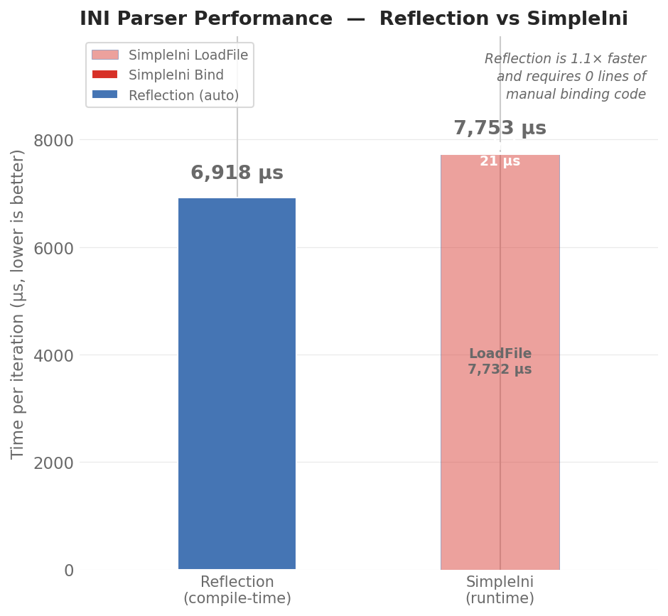

# INI Parser — C++26 Reflection (P2996)

A compile-time reflection-driven INI parser using C++26 `std::meta` (P2996) with `clang-p2996`.

## Environment

This project requires Bloomberg's [clang-p2996](https://github.com/bloomberg/clang-p2996) fork.  
Use the provided Docker image:

```bash
docker run --rm -it -v .:/work ghcr.io/bloomberg/clang-p2996:latest
```

Inside the container:

```bash
cd /work
bash build.sh
./ini_parser
```

## Usage

Each struct member of the root model maps to an INI section:

```cpp
struct Person {
    [[=rename("full_name")]]
    std::string name;
    [[=default_value(32)]]
    int age;
    [[=default_value("Chinese")]]
    std::string nationality;
};

struct Config {
    std::string host;
    [[=range(0, 65535)]]
    int port;
    bool debug;
    [[=default_value(5.0f)]]
    float timeout;
};

struct AllModels {
    Person person;
    Config config;
};

AllModels all;
IniParser::parse("combined.ini", all);
// all.person.* and all.config.* are now populated
```

## Annotations

| Annotation | Purpose | Example |
|---|---|---|
| `rename("key")` | Map field/section to different INI key/section name | `[[=rename("full_name")]]` |
| `range(min, max)` | Arithmetic range constraint | `[[=range(0, 65535)]]` |
| `default_value(v)` | Default when key missing | `[[=default_value(32)]]` |
| `length(min, max)` | String length constraint | `[[=length(0, 4)]]` |

## Build & Test

```bash
# Build main + run unit tests
bash build.sh

# Run benchmark (requires network for dependencies)
bash build_bench.sh
```

## Benchmark

Comparison against [SimpleIni](https://github.com/brofield/simpleini). 1000-line INI file,
100 iterations per case. The reflection parser performs **parse + bind** in a single pass;
SimpleIni requires a separate manual bind step (20 `GetValue` calls).

| Metric | Reflection | SimpleIni |
|---|---|---|
| Total (parse+bind) | **6,918 µs** | 7,753 µs |
| Bind only | automatic (0 lines) | 21 µs (20× `GetValue`) |
| Lines of binding code | 0 | 20 |



The reflection parser is **~12% faster overall**, and eliminates all manual binding code.
Performance is achieved via compile-time FNV-1a hash dispatch — field lookup is O(1)
per key instead of O(N) string comparison.

Results generated by `build_bench.sh` and charted with matplotlib.

## Reflection

```cpp
template <typename T>
void print_model(const T& value) {
    template for (constexpr auto member : std::define_static_array(
        std::meta::nonstatic_data_members_of(^^T, std::meta::access_context::current())))
    {
        std::cout << std::meta::identifier_of(member) << "="
                  << value.[:member:] << " ";
    }
}
```
